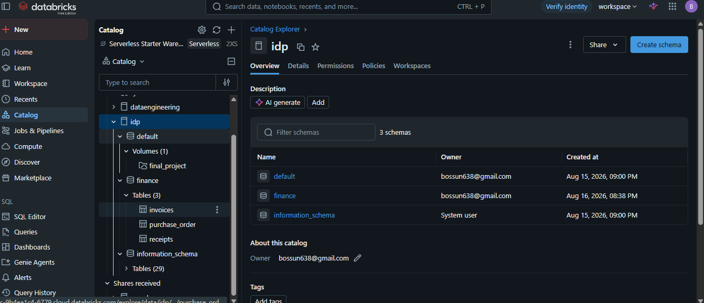
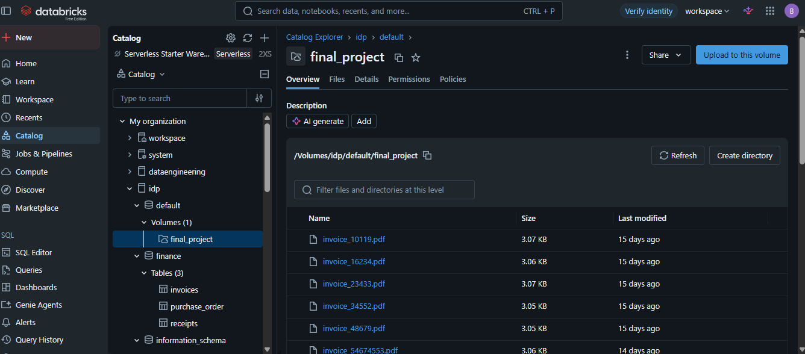
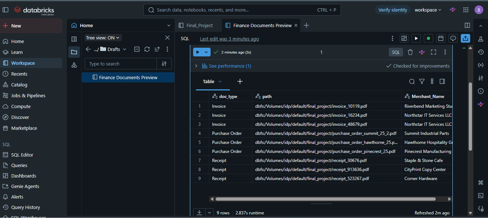

# Intelligent Document Processing (IDP) on Databricks

A production-style **Intelligent Document Processing** pipeline built natively inside Databricks. This project demonstrates how unstructured documents (PDFs, invoices, receipts, etc.) can be automatically ingested, parsed with AI, and transformed into governed, queryable tables — all within a single Databricks workspace.

---

## 🏗️ Architecture Overview

```text
Raw Documents (PDF / Invoice / Receipt)
        │
        ▼  (Unity Catalog Volume)
┌─────────────────────────────────┐
│     Ingestion Layer             │
└─────────────────────────────────┘
        │
        ▼  (ai_parse_document)
┌─────────────────────────────────┐
│     Structured Layout + Text    │
└─────────────────────────────────┘
        │
        ▼  (ai_extract + ai_classify)
┌─────────────────────────────────┐
│     Entity Extraction           │
└─────────────────────────────────┘
        │
        ▼
┌─────────────────────────────────┐
│  Governed Tables (idp schema)   │
└─────────────────────────────────┘
```

**High-level sequence:**

```text
Document Upload  ➡️  AI Parsing  ➡️  Entity Extraction  ➡️  Queryable Tables
```

---

## 🤖 Intelligent Document Processing (IDP) Layer

This repository incorporates an AI-driven **Intelligent Document Processing (IDP)** pipeline built natively inside Databricks to transform unstructured documents into queryable tables.

### 🔄 Document Processing Pipeline

1. **Ingestion:** Raw files (e.g., PDFs, invoices, receipts) are uploaded to a volume managed via Unity Catalog.
2. **AI Parsing:** Leveraged the `ai_parse_document()` SQL function to convert layout-heavy files into structured records containing layout hierarchies and tabular metadata.
3. **Entity Extraction:** Used `ai_extract()` and `ai_classify()` to pull key identifiers (such as total costs, document types, and transactional dates) directly from text chunks.

### 🛡️ Data Governance

All extracted data is isolated and secured in the `idp` schema inside the Databricks Catalog, ensuring proper data lineage tracking and granular access controls.

---

### 📊 Pipeline Architecture & Data Preview

#### 1. Unity Catalog Data Governance
This view confirms the isolation of our structured schemas, transactional tables, and cloud volumes inside the Databricks Unity Catalog environment.



---

#### 2. Unstructured Data Landing Zone (Volumes)
The landing zone containing our raw, layout-heavy input files (PDFs, receipts, invoices) stored natively within the managed workspace.



---

#### 3. AI-Parsed Structured Output
The final parsed table preview demonstrating successful text extraction, data classification, and column schema enforcement across our target domains.



---

## 🛠️ Tech Stack & Features

* **Platform:** Databricks (Unity Catalog enabled)
* **AI Functions:** `ai_parse_document()`, `ai_extract()`, `ai_classify()`
* **Storage:** Unity Catalog Volumes
* **Languages:** Spark SQL, Python
* **Governance:** Unity Catalog schema isolation + lineage

---

## 📂 Repository Structure

```text
├── notebooks/
│   ├── 01_document_ingestion.py      # Upload & register files to UC Volume
│   ├── 02_ai_parse_document.py       # ai_parse_document() processing
│   ├── 03_entity_extraction.py       # ai_extract() + ai_classify()
│   └── 04_governance_setup.py        # Schema & permissions
├── sql/
│   └── idp_queries.sql               # Example analytical queries
└── README.md
```

---

## 🔗 Live Resources

* **Workspace Notebook:**  
  https://dbc-9b4ea1c4-6779.cloud.databricks.com/editor/notebooks/1754171670003284?o=7474660702177872#command/8980957721468616

* **Catalog (`idp` schema):**  
  https://dbc-9b4ea1c4-6779.cloud.databricks.com/explore/data/idp?o=7474660702177872

---

## 🚀 How to Explore This Project

1. Open the linked notebook in the Databricks workspace.
2. Review the sequential cells that demonstrate:
   - File landing in a Unity Catalog Volume
   - Calling `ai_parse_document()`
   - Extracting structured entities with `ai_extract()` / `ai_classify()`
3. Navigate to the `idp` catalog/schema to inspect the resulting governed tables.

---

## 📌 Key Highlights for Recruiters

- End-to-end IDP pipeline using native Databricks AI functions
- Unity Catalog Volumes + schema isolation for proper governance
- Clear separation of ingestion → parsing → extraction → analytics
- Fully reproducible inside a Databricks workspace (no external services required)
- Demonstrates modern Lakehouse AI capabilities on unstructured data
